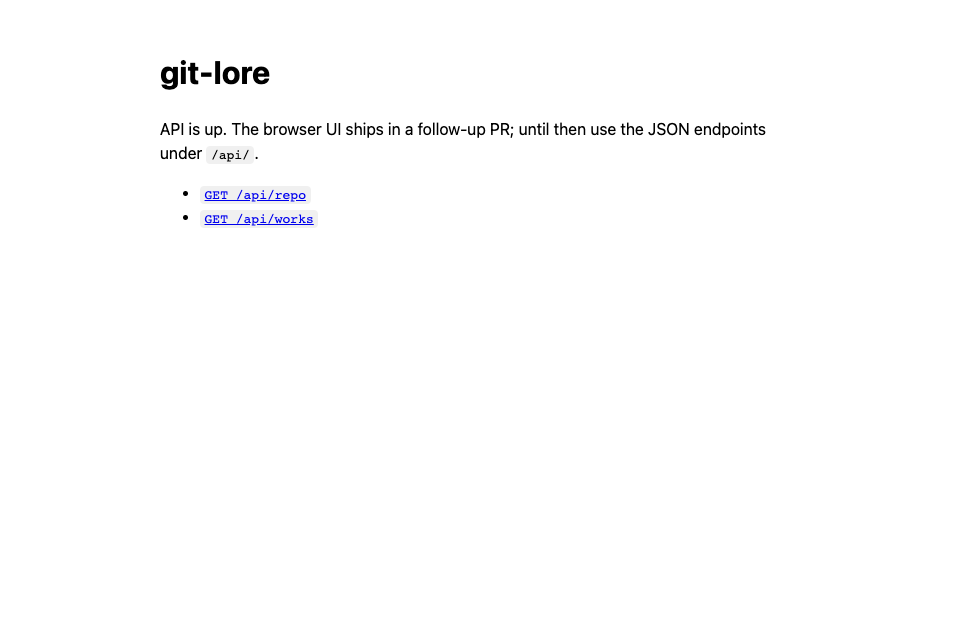

# git-lore CLI

Optional extension for [git-lore](../..): a Go CLI that can abstract Lore
operations for people who prefer commands over agent skills.

Today the only command is **`serve`** — a local browser UI for Lore Works.
Future subcommands can wrap the same Git conventions the skills use
(`list`, `show`, `create`, `edit`, `sync`, …) without requiring an agent.

This is an experiment. The repository’s primary surface remains the agent
skills under `skills/`.

## Build and run

```bash
make build
./bin/git-lore serve --repo ../.. --open
./bin/git-lore help
```

Flags for `serve`: `--repo <path>`, `--addr host:port` (default
`127.0.0.1:9473`), `--open`.

## Screenshots

Placeholder page until the Vue UI PR lands:



## Commands

| Command | Status | Purpose |
|---------|--------|---------|
| `serve` | implemented | Read-only Lore browser + remote fetch |
| `list` / `show` / `create` / … | planned | CLI counterparts to skill workflows |

## Scope (serve)

**In:** list Works, view Markdown, history/diffs, remote status, fetch.

**Out (for now):** create/edit/push from the UI; those stay skill-driven until
dedicated CLI subcommands land.

## Releases

When release-please publishes a GitHub Release, CI runs `make dist` and uploads:

- `git-lore_<version>_linux_amd64.tar.gz`
- `git-lore_<version>_linux_arm64.tar.gz`
- `git-lore_<version>_darwin_amd64.tar.gz`
- `git-lore_<version>_darwin_arm64.tar.gz`
- `git-lore_<version>_windows_amd64.zip`

Locally: `make dist VERSION=$(cat ../../version.txt)`.
