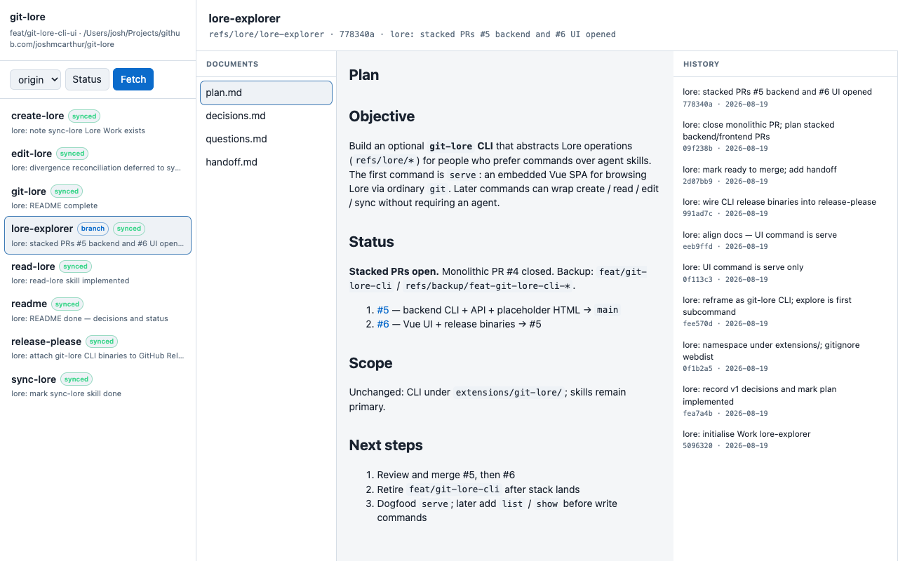
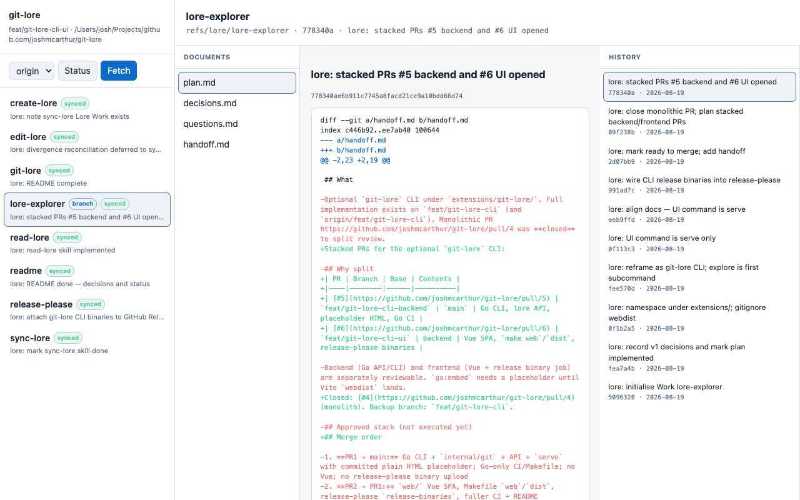
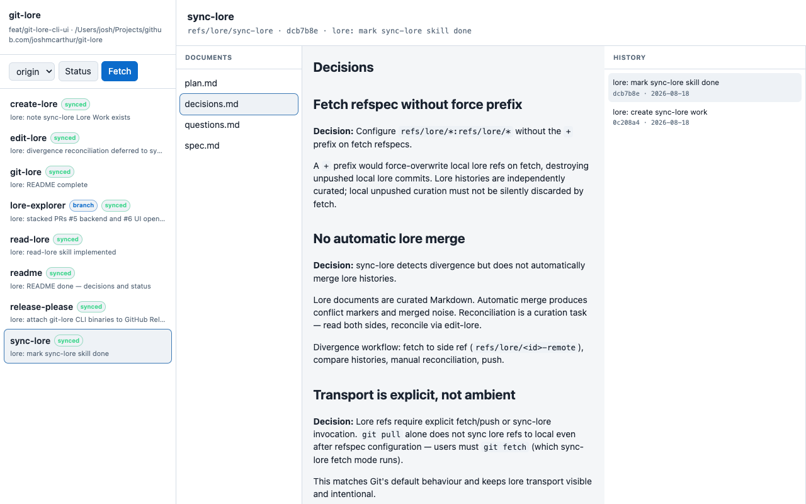

# git-lore CLI

Optional extension for [git-lore](../..): a Git external command (`git lore`)
that abstracts Lore operations for people who prefer commands over agent
skills.

**Architecture:**
- Shell scripts under `lib/git-lore/` for create / edit / list / sync (skill-aligned Git plumbing)
- Standalone Go binary `lib/git-lore/serve` for the read-only browser UI

Skills under `skills/` remain the primary surface. This CLI mirrors the same
Git conventions without requiring an agent.

## Install

### From source

```bash
cd extensions/git-lore
make install PREFIX=~/.local
# ensure ~/.local/bin is on PATH
git lore help
```

### From a GitHub Release archive

```bash
tar xzf git-lore_<version>_darwin_arm64.tar.gz -C ~/.local
# archive contains bin/git-lore and lib/git-lore/{*.sh,serve}
```

Windows: use Git Bash or WSL for git-ops commands (`create`, `edit`, …).
`git lore serve` runs natively via `serve.exe`.

## Build and run

```bash
make build
./bin/git-lore help
./bin/git-lore serve --repo ../.. --open
# or, with bin on PATH:
git lore serve --repo ../.. --open
```

Flags for `serve`: `--repo <path>`, `--addr host:port` (default
`127.0.0.1:9473`), `--open`.

## Screenshots

Work detail (document + history):



Commit diff:



Works sidebar:



## Commands

| Command | Purpose |
|---------|---------|
| `list` | List local Lore Works |
| `show` | Show Work metadata or a file (`git lore show <id> [file]`) |
| `create` | Initialise a new Work (`plan.md` from stdin or `--from`) |
| `edit` | Update a lore file (stdin, `--from`, or `--interactive`) |
| `export` | Export a Work tree to `--dir` |
| `delete` | Delete `refs/lore/<id>` |
| `branch` | List or set/unset `branch.*.lore` associations |
| `remote` | `fetch`, `push`, `sync`, or `status` against a remote |
| `serve` | Read-only Lore browser UI |

Most commands accept `--repo <path>` (default: current directory).

### Examples

```bash
git lore list --repo ../..
git lore show git-lore plan.md

cat plan.md | git lore create my-work --associate-branch

cat decisions.md | git lore edit my-work --file decisions.md \
  --message "lore: record auth decision"

git lore export my-work --dir /tmp/my-work

git lore remote status
git lore remote sync --remote origin
git lore remote push --work-id my-work
```

## Scope

**In:** list/show/create/edit/export/delete Works, branch associations,
remote fetch/push/sync/status, browser UI for read-only exploration.

**Out:** browser UI mutations (create/edit from `serve`); REST API write
endpoints; automatic divergence merge; curation gate enforcement in CLI;
`--json` CLI output (use `git show refs/lore/<id>:file` or the serve API).

## Layout

```
bin/git-lore              # dispatcher (git lore → lib/git-lore)
lib/git-lore/
  *.sh                    # skill-aligned shell commands
  serve                   # Go binary (built by make)
cmd/git-lore-serve/       # serve source
internal/git/             # read layer for serve API only
```

## Releases

When release-please publishes a GitHub Release, CI runs `make dist` and uploads
archives containing `bin/git-lore` + `lib/git-lore/{*.sh,serve}`:

- `git-lore_<version>_linux_amd64.tar.gz`
- `git-lore_<version>_linux_arm64.tar.gz`
- `git-lore_<version>_darwin_amd64.tar.gz`
- `git-lore_<version>_darwin_arm64.tar.gz`
- `git-lore_<version>_windows_amd64.zip`

Locally: `make dist VERSION=$(cat ../../version.txt)`.
